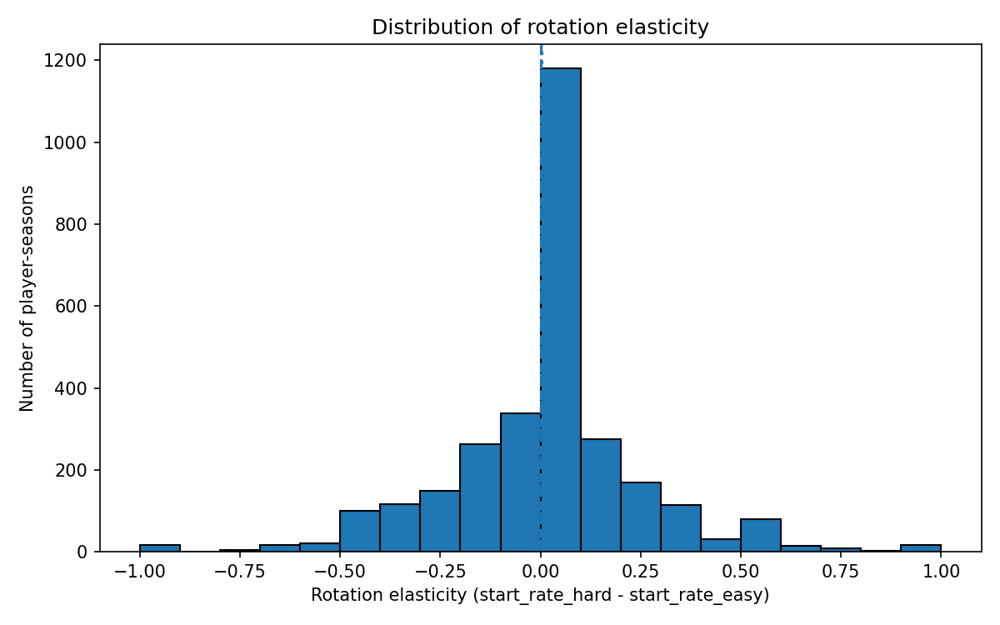
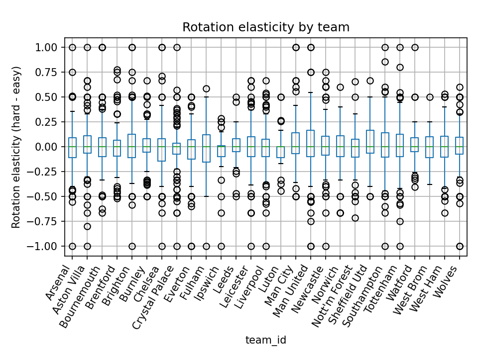
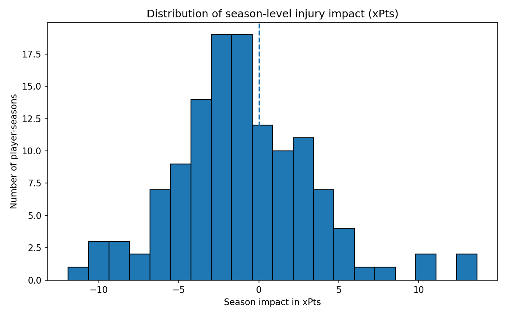
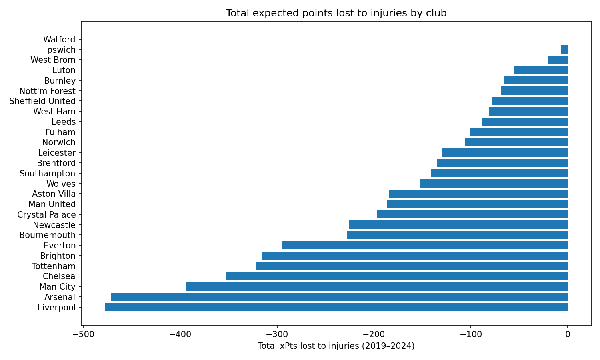
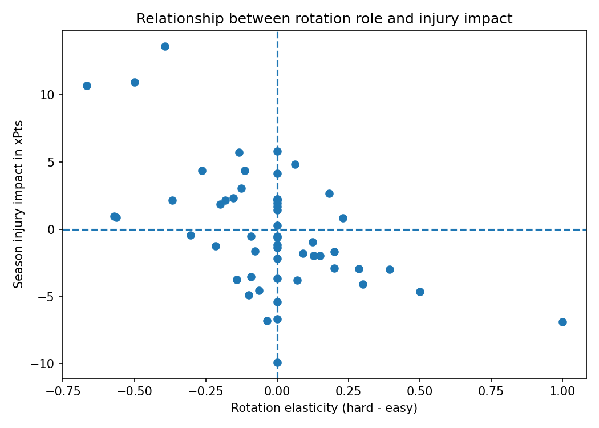

# Abstract

Rotation and injury-related absences are routinely cited as drivers of team performance in the English Premier League (EPL), yet they are rarely quantified in a player-specific, season-comparable way using public data. This project addresses that measurement gap by constructing two interpretable player-season proxies that link squad management decisions and availability shocks to performance outcomes. 
Using match-level lineups and injury logs across six seasons (2019/20–2024/25) and 27 teams (including promoted and relegated clubs), I define match context via opponent strength and estimate **Rotation Elasticity** as the change in a player’s starting likelihood between “hard” and “easy” fixtures. I also estimate **Injury Impact** by comparing team outcomes during a player’s injury absences to within-team baselines, reducing sensitivity to persistent team quality. Performance is measured primarily in expected points (xPts) and can be expressed in approximate monetary terms (GBP) through the financial stakes of league position. Empirically, both proxies exhibit substantial heterogeneity across roles and squads: Rotation Elasticity is concentrated near zero on average but shows wide dispersion, while Injury Impact is more negative for high-usage players, consistent with larger marginal losses when core starters are unavailable. The main contribution is a reproducible pipeline and dataset of player-season measures enabling downstream ranking, profiling, and squad-level aggregation.


**Keywords:** Data Science, Python, Sports Analytics, Football, Premier League, Expected Points, Player Availability, Squad Rotation

# 1. Introduction

The English Premier League (EPL) is one of the most financially and competitively intense football leagues worldwide. Clubs operate under congested calendars, high physical demands, and steep payoffs to league position (broadcast revenue, prize money, and European qualification). In this setting, two operational issues repeatedly arise: **rotation** (how managers allocate starts/minutes across fixtures) and **availability shocks** (injury-driven absences). Both are widely discussed by practitioners and analysts, yet they are rarely quantified in a **player-specific, season-comparable, outcome-linked** way using public data.

**Problem statement.** Standard descriptive metrics (minutes, appearances, goals/assists) do not capture *when* a player is used (e.g., whether they are trusted more in high-difficulty fixtures) nor the *performance cost* when a player becomes unavailable. Building comparable player-season measures is non-trivial because match context must be defined consistently, stronger players are selected into harder games, and injury logs from public sources contain noise. This project addresses that measurement gap by constructing two interpretable proxies from public lineup and injury data that link squad management to expected-performance outcomes.

**Research questions.**
1. **Rotation behaviour:** Can match difficulty be operationalised consistently and summarised as a player-season statistic that reflects selective deployment (hard vs easy fixtures)?
2. **Injury-related performance cost:** When a player is unavailable due to injury, what is the associated change in team performance, and can this be measured at the player-season level using within-team comparisons?
3. **“Fair value” interpretation:** Do these proxies meaningfully differentiate player-seasons (e.g., core starters vs situational players; high-cost vs low-cost absences) in a way that complements conventional statistics?

**Contributions and deliverables.** The project delivers (i) a reproducible pipeline integrating match schedules, player participation, and injury spells across six EPL seasons (2019/20–2024/25) and 27 clubs, and (ii) two player–team–season proxies:
- **Proxy 1 — Rotation Elasticity:** the change in starting likelihood between “hard” and “easy” fixtures (context defined using expected match difficulty).
- **Proxy 2 — Injury Impact:** a within-team estimate of how team expected points change in matches where the player is unavailable, controlling for opponent effects and within-season trends. Results are reported in expected points (xPts) and can be expressed in approximate GBP terms using season-specific points-to-money mappings.

**Report structure.** Section 2 reviews literature on rotation/fixture congestion, injuries and availability, public injury data limitations, and expectation-based performance metrics. Section 3 describes data sources, preprocessing, match-context definitions, and proxy construction. Section 4 presents summary statistics, diagnostic validation, and figures. Section 5 discusses interpretation, limitations, and robustness. Section 6 concludes and outlines extensions (alternative context definitions, stronger identification strategies, and recruitment/squad-planning applications).


# 2. Literature Review

This project draws on four closely related bodies of work:
1. squad rotation and fixture congestion
2. injury incidence and player availability
3. public injury datasets (and limitations)
4. Football performance measurement frameworks (xG/xPts and attribution methods)
Together, these streams motivate the proxy-based approach used here and clarify the gap the project addresses.

## 2.1 Squat rotation, fixture congestion, and performance trade-offs

Rotation is commonly framed as a managerial response to congested schedules and cumulative fatigue, with the aim of sustaining performance and mitigating injury risk. Systematic evidence indicates that injury risk is generally higher during fixture-congested periods, although effects can vary by injury definition and setting. At the club-study level, Carling et al. (2012) report that high-intensity running and injury risk were largely unchanged during a prolonged congested period—an outcome they interpret as consistent with compensatory strategies such as squad rotation and recovery protocols.
Beyond congestion, recent applied research has begun to quantify whether rotation correlates with results. Mehta et al. (2024) examine squad rotation in top European leagues and suggest that rotation is not uniformly beneficial for points accumulation; effects depend on context such as team resources/quality. At the match level, Yang et al. (2025) find evidence consistent with the idea that excessive rotation is associated with worse outcomes, partly mediated through passing and shooting performance.

Relevance for this project. The literature motivates a rotation measure that is contextual, since “rotation” is not only about total minutes but also about selective deployment across match difficulty.

## 2.2 Injuries, availability and team success

Elite football injury epidemiology is well established. The UEFA injury study documents stable but substantial injury incidence in professional football and provides benchmark rates and patterns for match versus training injuries.Importantly, research also links injuries to competitive outcomes. Hägglund et al. (2013), using an 11-year follow-up of UEFA Champions League teams, report that higher injury burden and lower match availability are associated with worse performance outcomes in league and European competition.
A complementary practitioner-facing scientific stream emphasises player availability as an operational performance driver in elite team sports, arguing that keeping key players selectable may matter more than maintaining occasional peak performance.

Relevance for this project. This evidence supports treating injuries as availability shocks with potential downstream performance costs, motivating an “injury impact” proxy anchored in team outcomes during absence periods.

## 2.3 Public injury data (Transfermarkt) and measurement constraints

Because verified medical datasets are rarely public, many applied studies rely on media-compiled injury records such as Transfermarkt. However, the validity of media-based injury reporting is not uniform. Krutsch et al. (2020) evaluate media-reported injuries against clinical information and conclude that validity is higher for certain severe injury types, implying that researchers should apply cautious designs when using such data.
Despite these limitations, public databases can support large-scale analysis: Hoenig et al. (2022) analyse more than 20,000 injuries using a citizen-science approach and discuss both the opportunity and caveats for epidemiological research.

Relevance for this project. These findings motivate conservative claims and robustness-oriented proxy construction—specifically, relying on within-team comparisons rather than assuming high-fidelity medical labels.

## 2.4 Performance measurement: xG, xPts and player attribution

Football outcomes are low-scoring and noisy, motivating the use of model-based metrics such as expected goals (xG) and derived probability-based outcomes. Mead et al. (2023) provide recent peer-reviewed evidence that expected-goals models can be strong predictors of future team success relative to traditional statistics and discuss evaluation of xG modelling choices.
For player-level impact estimation, plus–minus frameworks adapt methods used in basketball and hockey to football. Kharrat, López Peña, and McHale propose variants using expected goals and expected points to reduce variance and align contributions with probabilistic match outcomes.

Relevance for this project. Rather than estimating a full regularised plus–minus model (which is data- and modelling-intensive), this project adopts a proxy approach using expected-points-facing outcomes (xPts) and transparent within-team contrasts, prioritising interpretability and reproducibility.

## 2.5 Gap addressed by this project

Across the literature, two practical gaps remain for a reproducible, player-season framework using public data:
    1. **Context-dependent rotation at the player-season level.** Existing rotation work often focuses on team-level rotation rates or match-level stability and links rotation to points or performance channels.Fewer approaches produce an interpretable player-season statistic capturing how a player’s starting likelihood changes by match difficulty (i.e., selective deployment).
    2. Outcome-linked injury cost measures robust to public injury data limitations. Injuries and availability are strongly connected to team performance, yet public injury logs contain measurement error. This creates scope for a method that remains informative under noisy injury reporting while still linking absences to expectation-based performance outcomes.

This project addresses these gaps by constructing two interpretable player-season proxies Rotation Elasticity (contextual starting selectivity) and Injury Impact (within-team outcome change during injury absences) and delivering a reproducible dataset suitable for downstream ranking, profiling, and squad-level aggregation.


# 3. Methodology

This project is implemented as a reproducible three-stage pipeline that starts from public football data and ends with two interpretable player-season proxy measures. The guiding methodological choice is to prioritise transparent, season-comparable measurement over a complex predictive model. In practice, turning rotation behaviour and injury impact into player-specific quantities requires careful data integration, consistent operational definitions, and conservative handling of noisy public injury records. The pipeline therefore proceeds in three steps: data collection and processing, proxy construction, and evaluation and reporting.

## 3.1 Data Description


- **Source**
The dataset combines four sources, each covering a distinct component of the measurement problem. Match structure and basic match-level information are taken from Football-Data.co.uk (per-season CSV files). Player match participation and lineup usage are taken from Understat, which provides match-level player data including minutes played and whether a player started. Injury absences are taken from Transfermarkt, which lists injury spells (start and end dates) and is one of the few sources available at scale for multiple EPL seasons. Finally, the official Premier League website provides season-level prize money by league position, which can be used to express expected performance differences in approximate monetary terms (GBP) as an optional translation layer.

- **Size**
After extraction, the data are transformed into structured panels that support proxy estimation. The primary competition is the EPL, covering six seasons (2019/20–2024/25). Across this period there are 27 unique clubs due to promotion and relegation (20 teams per season, with three changing each year). The pipeline produces three main data structures. First, a match–team / match–player panel aligns each match to season, match identifier, date, team and opponent identifiers, and the key player usage fields required for rotation measurement (starter indicator and minutes). Second, an injury spell panel represents each injury as an interval with a start and end date, linked to season, team, and player. Third, the pipeline generates player-season proxy tables, one row per player-season-team, which form the final outputs.

- **Characteristics**
All collected data are stored in consistent CSV formats and include a mix of string identifiers, numeric fields, and binary indicators. A critical preprocessing task is entity harmonisation. Team names differ across sources (e.g., “Man United” vs “Man Utd”), which can silently break merges and induce missingness. To prevent this, the pipeline constructs a canonical mapping of all 27 club names and applies it consistently across datasets prior to merging. Where player name discrepancies occur, they are handled conservatively: because the number of inconsistent spellings is small relative to the overall dataset, unresolved cases are excluded rather than risking incorrect matches. 
A key intermediate dataset its the rotation panel, built by joining a team-match panel containing match-level xPts (from the processed match pipeline), and understat per-player match rows containing minutes and a starter indicator.
Concretely, the join is performed on (season, date, team_id) after normalising dates to midnight to avoid timestamp mismatches. The match panel is validated to ensure uniqueness on these join keys (one row per team per league match), and the merge is constrained as a many-to-one join (many player rows per team-match). Understat rows that do not match the league schedule (e.g., cup matches, friendlies, or remaining date inconsistencies) are dropped. The resulting output is written as panel_rotation.csv (and optionally as Parquet), with one row per player–team–match containing identifiers and core analysis fields.

- **Features**
At minimum, the pipeline relies on the following fields,
1. Rotation panel:
    - identifiers: season, match_id, date
    - context: team_id, opponent_id, home_away
    - player usage: player_name (or player_id), started (binary), minutes(integer)
    - performance: xpts (or optionally translated into GBP based on prize money)
    - derived: days_rest (days since the player's previous appearance, capped to a maximum to avoid extreme values)

2. Injury panel:
    - identifiers: season, team_id, player_name
    - injury spell: injury_start, injury_end
    - derived fields: match-level availability indicator or a list of missed matches generated by intersecting injury windows with match dates
    
- **Data quality**
Public injury data introduces important measurement constraints. Transfermarkt injury windows can be approximate: players may return earlier or later than listed, creating apparent inconsistencies when Understat records minutes played during a nominal injury spell. The methodology treats this as noise inherent to public injury reporting rather than as a data “error” that can be fully corrected. To reduce sensitivity to this issue, the Injury Impact proxy relies on within-team comparisons, and the pipeline applies sample restrictions to exclude player-seasons with insufficient support for stable estimation (e.g., very few appearances or too few matches in relevant categories). These restrictions limit extreme values driven by small samples and improve the comparability of proxy estimates across seasons and teams.

## 3.2 Approach

The project’s central methodological contribution is the construction of two proxies that translate qualitative football concepts—rotation and injury-related unavailability—into player-season measures that are interpretable and comparable across clubs and seasons. The approach is deliberately measurement-focused rather than model-heavy: the priority is to build transparent and auditable quantities from public data, while acknowledging and mitigating the limitations that come with scraping and integrating heterogeneous sources.

- **Algorithms**
Data acquisition combines direct downloads and scripted extraction depending on the source. Football-Data.co.uk provides season-level CSV files that can be downloaded directly, so the “algorithmic” component is primarily automated ingestion and consistent season-by-season organisation. Understat does not provide a simple bulk export for the player-match fields required here (minutes played and starter indicators). Understat data are therefore collected programmatically by extracting match-level player participation and compiling it into structured season files and a consolidated master dataset.

Transfermarkt injuries are the most operationally complex source. Injury spells must be scraped from web pages and transformed into season-level injury logs with start and end dates per player. This extraction step is also the most time-consuming (roughly 20–25 minutes per season), reflecting both the volume of pages and the need for respectful request pacing.

Two implementation choices that materially improved reliability without changing the statistical logic were logging and run metadata. Logging records what each script did (inputs read, outputs written, rows dropped, validation checks passed/failed), which is critical when multi-source integration can otherwise fail silently. Run metadata records execution context (timestamp, script name, key parameters such as thresholds and dry-run flags, and output paths). Together, these produce an audit trail that improves debugging, reproducibility, and external verifiability.

- **Preprocessing**
Preprocessing is designed to produce merge-ready panels and to prevent silent inconsistencies from contaminating proxy estimates. First, identifiers and types are standardised across sources: dates are parsed and normalised, numeric variables are coerced consistently, and starter indicators are converted robustly to binary. Rows with missing values in fields essential for proxy construction are excluded rather than imputed, since imputation would introduce additional assumptions and could mechanically affect rate-based or regression-based estimates.

Second, entity harmonisation is treated as a core requirement. Team names differ across sources and can otherwise lead to missed joins or duplicate entities. A canonical mapping is applied prior to merging so that each club is represented consistently across seasons and datasets. Player-name discrepancies occur less frequently; unresolved cases are handled conservatively by exclusion rather than uncertain matching.

Third, the project constructs two intermediate panels that form the input to proxy estimation:
- A team-match panel with expected points (xPts), built from 1X2 betting odds.
- A player-team-match rotation panel and a player-team-match injury panel, both aligned to the team-match panel by (season, date, team).
The rotation panel is produced via a validated many-to-one merge (many player rows to one team-match row), and Understat rows that do not match the league schedule (e.g., cups/friendlies or residual date mismatches) are dropped. The injury panel is built by expanding each player–team–season in the injury spell data to all matches for that team-season, then marking match-level unavailability by intersecting match dates with injury windows. Where available, Understat minutes/starts are merged into the injury panel as additional context.

Finally, the pipeline applies sample restrictions to limit instability from sparse player-seasons (e.g., minimum match counts for Proxy 1 and minimum unavailable/available matches for Proxy 2).

- **Model architecture**
No machine learning or deep learning architecture is used; instead, the “model” is the proxy construction logic and the associated estimation design. The pipeline produces two player-season outputs and then merges them into a single combined player-season panel to support downstream analysis.

Expected points (xPts) construction (input to both proxies).
Match-level expected points are computed from 1X2 betting odds by converting odds into implied probabilities and normalising to remove the bookmaker margin. Let $p_H$, $p_D$, and $p_A$ denote the normalised implied probabilities of a home win, draw, and away win, respectively. Expected points are then computed per side as:

$$
xPts_{home} = 3p_H + 1p_D, \qquad xPts_{away} = 3p_A + 1p_D.
$$

This produces a long-form team–match panel with two rows per match (home and away), which is used downstream in both proxy construction and validation.

**Proxy 1 — Rotation Elasticity (player–team–season)**

Rotation Elasticity is computed from the player–team–match rotation panel (joined on $(season, date, team\_id)$), which contains `started`, `minutes`, and match-level `xpts`. Match context is defined within each team-season using the distribution of team match-level xPts. For each $(team\_id, season)$ pair, tercile thresholds are computed:

$$
q_{low} = \text{quantile}(xPts, 1/3), \qquad q_{high} = \text{quantile}(xPts, 2/3).
$$

Each match is assigned a stakes category:

- **hard** if $xPts \le q_{low}$
- **easy** if $xPts \ge q_{high}$
- **medium** otherwise

For each player–team–season, starting rates are computed within the hard and easy groups:

$$
\text{start\_rate}_{hard} = \Pr(\text{started}=1 \mid \text{hard}), \qquad
\text{start\_rate}_{easy} = \Pr(\text{started}=1 \mid \text{easy}).
$$

Rotation Elasticity is then defined as:

$$
\text{rotation\_elasticity} = \text{start\_rate}_{hard} - \text{start\_rate}_{easy}.
$$

Player–team–seasons are retained only if the estimate is supported by sufficient observations (default thresholds: `min_matches = 3`, `min_hard = 1`, `min_easy = 1`) and the resulting elasticity is non-missing.

**Proxy 2 - Injury Impact (DiD-style OLS per player-team-season)**

Injury Impact is estimated using a player–team–match injury panel with one row per $(match\_id, team\_id, player)$, where `unavailable` indicates whether the match date falls within any recorded injury spell for that player in the same team-season. The panel also includes match-level `xpts`, opponent identity, and the number of injured players in the squad (`n_injured_squad`). Where available, Understat `minutes` and `started` are merged in as additional context.

Estimation is performed separately for each player–team–season using an OLS specification:

$$
xPts_m = \alpha + \beta \cdot \text{unavailable}_m + \gamma \cdot \text{n\_injured\_squad}_m
+ \delta_{\text{opponent}(m)} + \tau \cdot \text{match\_index}_m + \varepsilon_m.
$$

The model includes opponent fixed effects ($C(opponent\_id)$) and a numeric within-sample time trend (`match_index`) to reduce sensitivity to gradual within-season changes. The coefficient $\beta$ on `unavailable` is retained as the player-season injury proxy (`beta_unavailable`). Player–team–seasons are filtered to ensure estimability and support in both states (default thresholds: `min_unavail = 2`, `min_avail = 2`). Standard errors are clustered by opponent when enough opponent clusters are available; otherwise heteroskedasticity-robust (HC1) standard errors are used.

**Combined dataset**
Finally, the rotation and injury proxy outputs are merged into a single player-season-team dataset using an outer join on $(player\_id, season, team\_id)$. An outer merge is used because coverage differs across proxies; retaining unmatched player-seasons supports inspection and robustness checks. The combined file also includes simple coverage flags (e.g., whether a player-season has a valid rotation proxy and/or injury proxy).

- **Evaluation metrics**

Because the project’s objective is measurement rather than prediction, evaluation focuses on whether the proxies are computable, stable, and interpretable at scale. Success is assessed through reproducibility of outputs given fixed inputs (supported by deterministic scripts, logging, and run metadata), coverage and stability ensuring estimates are not driven by sparse player-seasons and face-validity diagnostics, including summary statistics and plots that verify whether the proxies behave plausibly (e.g., differentiating core starters from situational players and exhibiting meaningful variation across roles and squads). The analysis phase therefore emphasises diagnostic evidence that the proxies capture interpretable structure in the data, rather than optimising a predictive score.

## 3.3 Implementation

The project is implemented entirely in Python and organised as a modular, file-based pipeline. The implementation philosophy is pragmatic: each stage produces clearly defined intermediate artefacts (CSV and, where available, Parquet), so downstream steps operate on stable inputs rather than recomputing upstream work. This design improves reproducibility, makes failures easier to diagnose, and allows individual components (e.g., a panel builder or a proxy script) to be executed and tested in isolation.

- **Languages and libraries**
All code is written in Python 3 using a standard data-science stack. pandas and NumPy provide the core functionality for tabular manipulation—type coercion, joins, group-by aggregation, and feature engineering. statsmodels is used for the regression-based estimation of the injury proxy, where the goal is not prediction but a structured within-season comparison that returns an interpretable coefficient. The scripts use argparse to expose a consistent command-line interface (input paths, output paths, thresholds, and dry-run flags), and pathlib to ensure file paths are handled robustly across environments. In the analysis stage, figures and summary outputs rely on common plotting utilities (e.g., matplotlib) and descriptive summarisation in pandas.

Beyond these external libraries, a small set of internal utilities supports robustness and engineering quality. A central configuration object (Config.load()) standardises directory structure and default paths; logging helpers (setup_logger) provide consistent run-time traces; and run metadata (write_run_metadata) records execution context and key parameters so results can be reproduced and audited. Finally, outputs are written using an atomic write utility (atomic_write_csv) to avoid partial files if a run is interrupted.

- **System architecture**
The system architecture follows a “build panels → build proxies → merge → analyse” pattern. Conceptually, the pipeline is a directed chain of transformations where each component has a narrow responsibility and communicates with the next stage through explicit data products on disk.

At the foundation is a team–match panel that provides match-level expected points (xPts). In the implementation, xPts is derived from 1X2 betting odds by converting odds into implied probabilities, normalising to remove the bookmaker margin, and then translating those probabilities into expected points for the home and away teams. The result is a long-form match panel with two rows per match (home and away), which becomes the shared performance backbone for both proxies.

On top of this match backbone, the pipeline constructs two player-oriented panels. The rotation panel is produced by aligning Understat player-match participation (minutes and a starter indicator) with the team–match panel. The merge is performed on (season, date, team_id) after normalising dates to prevent timestamp mismatches, and it is guarded by key-uniqueness checks that prevent unintended many-to-many joins. Rows that cannot be matched to league fixtures (typically cups, friendlies, or residual date inconsistencies) are dropped so the panel represents the EPL schedule only. This panel is then enriched with derived fields such as days_rest, computed as the number of days since a player’s previous recorded appearance and capped to avoid extreme values.

The injury panel is built in a way that reflects the structure of injury data itself. Injury information enters as spell intervals (start date and end date) rather than match-level observations. The implementation therefore expands each player–team–season present in the injury spell data to all matches in the corresponding team-season, and then flags match-level unavailability by checking whether each match date falls within any injury interval. Where available, Understat minutes and starter information are merged into this panel to provide additional context. The resulting dataset is indexed at the match level (one row per (match_id, team_id, player)), which is the natural format for the regression-based injury proxy.

Proxy estimation is then performed as dedicated, deterministic scripts. Proxy 1 (Rotation Elasticity) assigns match context using team-season xPts terciles and computes the difference between starting rates in “hard” and “easy” contexts. Proxy 2 (Injury Impact) estimates a per player–team–season OLS model of xPts on a match-level unavailability indicator, controlling for opponent fixed effects, a within-season time trend, and squad-level injury burden. Both scripts implement minimum-support filters to reduce small-sample instability and output one row per player–team–season.

Finally, the proxy outputs are combined into a single player-season dataset through a controlled merge step. The implementation uses an outer join on (player_id, season, team_id) because coverage differs across proxies; retaining player-seasons that appear in only one proxy supports later inspection, robustness checks, and transparent reporting of sample sizes. The combined dataset is then used in downstream analysis scripts to generate summary tables, validation figures, and descriptive insights.

- **Key code components**

Implementation quality relies on a small number of recurring patterns that appear across scripts and materially reduce the risk of silent errors.

First, the code consistently applies schema validation before and after major transformations. Required columns are checked explicitly, and non-empty assertions fail fast when an upstream step has not produced valid outputs. Second, joins are treated as a high-risk operation and are therefore handled defensively: match panels are validated for uniqueness on join keys, merges use validate="many_to_one" where appropriate, and duplicate-key checks prevent many-to-many merges that would silently inflate row counts.

Third, reproducibility is supported by an explicit execution trace. Logging records the shape of key datasets, the number of dropped rows (e.g., unmatched Understat rows), the thresholds used in filtering, and the location of outputs. Run metadata complements this by recording the runtime context (script name, timestamp, parameter values such as min_matches, min_unavail, and min_avail). This combination is particularly valuable in a multi-stage pipeline: it makes it possible to understand exactly how a given output was produced, and it allows the pipeline to be rerun under identical conditions.

Lastly, outputs are written using atomic writes to protect against partial or corrupted files. This is a small engineering detail, but it is important in practice: many pipeline issues stem from incomplete outputs produced by interrupted runs. Atomic writes ensure that a file is only replaced once a full write has completed successfully, which helps keep intermediate artefacts reliable for downstream stages.


# 4. Results

## 4.1 Experimental Setup
- **Hardware**
All development and execution were performed on a MacBook Pro (13-inch, 2019) running macOS Sequoia 15.7.2, equipped with a 2.4 GHz Quad-Core Intel Core i5, 8 GB 2133 MHz LPDDR3 RAM, and Intel Iris Plus Graphics 655 (1536 MB). The project was developed primarily in VS Code within a Nuvolos environment (with some early development performed in PyCharm before consolidating in VS Code). From a computational perspective, the workflow is effectively CPU-bound: no GPU acceleration is required or explicitly used for proxy construction, regression estimation, or figure generation. The only stage that is time-intensive in an end-to-end run is the optional Transfermarkt scraping, which is constrained mainly by request pacing and throttling avoidance rather than heavy numerical computation. Importantly, the reproducible entrypoint used for evaluation (main.py) operates on already processed and cleaned CSV/Parquet artefacts, and therefore does not trigger scraping.
- **Software**
The pipeline is implemented in Python 3.13.5. Core data processing and analysis rely on standard scientific Python libraries, including pandas and NumPy for tabular manipulation and aggregation, statsmodels for regression-based estimation of the injury proxy, and matplotlib and plotly for visualisation. Data extraction and parsing utilities include requests, beautifulsoup4, and python-dateutil. Where available, pyarrow (>=14) is used to support Parquet outputs alongside CSV. For asynchronous extraction of Understat data during data collection, the project uses aiohttp and the understat package. The project is organised as a modular set of scripts executed through a single orchestrator, and reproducibility is supported by consistent logging and run metadata written at runtime.
- **Hyperparameters**
Because the project is measurement-focused rather than model-training-focused, the relevant “hyperparameters” consist of pipeline thresholds and estimation settings rather than learning rates or batch sizes.

Proxy 1 (Rotation Elasticity): match context is defined within each team-season by assigning matches to hard/medium/easy terciles based on match-level xPts. Rotation Elasticity is computed per player–team–season as the difference in starting rates between hard and easy matches. Player-seasons are retained only if supported by minimum observations (default thresholds: min_matches = 3, min_hard = 1, min_easy = 1).

Proxy 2 (Injury Impact): estimated separately for each player–team–season using an OLS specification with an unavailability indicator and additional controls (opponent fixed effects, within-season time trend, and squad-level injury burden). Player-seasons are retained only if both states are observed (default thresholds: min_unavail = 2, min_avail = 2). Standard errors are clustered by opponent when sufficient opponent clusters exist; otherwise heteroskedasticity-robust (HC1) standard errors are used.
- **Training details**
No machine learning model is trained in this project, so epochs, batch size, learning rate, and cross-validation are not applicable. Instead, Proxy 1 is computed deterministically via aggregation on a match-level panel, and Proxy 2 is estimated via repeated per player–team–season regressions under a fixed specification. Evaluation therefore focuses on reproducibility, coverage, and diagnostic validity (summary statistics and figures) rather than predictive performance on a held-out set.

## 4.2 Performance Evaluation

This section reports the outputs of the end-to-end pipeline executed via `main.py`. The orchestrator rebuilds the intermediate match-aligned panels from already processed artefacts, constructs both player-season proxies, merges them into a combined dataset, and generates the project’s diagnostic tables and figures.

### 4.2.1 Panel construction and coverage

The pipeline begins by constructing two match-aligned panels that serve as the inputs to proxy estimation.

The injury panel (`panel_injury`) is built at match level with one row per `(match_id, team_id, player_name)` for players observed in the injury spell data. In the executed run, the injury panel contains **78,243 rows** and an average match-level unavailability rate of **0.355**. This rate reflects that the spell data contains both injury and suspension windows and that the panel is defined over player–team–seasons with at least one recorded spell.

The rotation panel (`panel_rotation`) is constructed by merging Understat player-match participation (minutes and a starter indicator) with the EPL team-match schedule on `(season, date, team_id)` after date normalisation and join-key validation. The resulting rotation panel contains **67,042 rows**. During alignment, **2,228** Understat rows are dropped because they do not correspond to league fixtures (most plausibly cup matches, friendlies, or residual date mismatches). This exclusion is intentional: it restricts downstream estimation to the EPL schedule and prevents non-league matches from contaminating the proxy definitions.

### 4.2.2 Proxy 1 — Rotation Elasticity

Proxy 1 produces a player–team–season measure of selective deployment across match contexts. Within each team-season, matches are assigned to **hard / medium / easy** terciles based on match-level xPts, and Rotation Elasticity is computed as the difference in starting rates between hard and easy matches. Using the default support thresholds (`min_matches=3`, `min_hard=1`, `min_easy=1`), the pipeline produces **2,924 player-season estimates** covering **1,134 players** and **27 teams** across seasons **2019–2024**.

The Rotation Elasticity distribution is centred close to zero, with a mean of **0.0021** and a standard deviation of **0.2471**. A mean near zero is consistent with the proxy definition: many player-seasons show broadly similar starting likelihoods across contexts, while dispersion reflects heterogeneous managerial selectivity (both positive and negative) across squads, roles, and seasons. Supporting figures—including a histogram, team-level boxplots, and season trend plots—are saved to facilitate interpretation and cross-season comparison.

### 4.2.3 Proxy 2 — Injury Impact (DiD-style OLS)

Proxy 2 estimates a match-level association between team expected points and player unavailability within each player–team–season under the fixed specification described in Section 3.2. Applying the default support thresholds (`min_unavail=2`, `min_avail=2`), the pipeline retains **1,968** candidate player–team–seasons and successfully estimates **1,967** injury coefficients (one player-season fails estimation due to a numerical issue). The mean estimated unavailability coefficient is **-0.0041** in match-level xPts units, indicating that the average fitted within-team association is small in magnitude.

To improve interpretability, the regression output is translated into season-level aggregates (e.g., `xpts_season_total`) and then optionally expressed in approximate monetary terms using season-specific points-to-GBP mappings. A final “named” injury proxy file is produced with **1,967 rows**, and the Understat ID match rate in that file is **83.427%** (**326 missing**), reflecting partial name/ID linkage coverage across sources. The pipeline also generates summary visualisations, including a top-10 ranking of injury totals and club-level injury “bills.”

### 4.2.4 Combined proxy dataset and relationship between proxies

The two proxy outputs are merged into a single player–team–season dataset using an outer join on `(player_id, season, team_id)` to preserve proxy-specific coverage. The combined dataset contains **3,471 rows** across **27 teams**, with **2,924** rows containing a valid Rotation Elasticity estimate, **1,967** rows containing a valid Injury Impact estimate, and **1,420** rows where both proxies are observed simultaneously. The difference in coverage is expected because the proxies have different estimability requirements: Proxy 1 depends on sufficient “hard” and “easy” exposure, while Proxy 2 requires observed matches in both availability states.

Within the overlapping subset, the correlation between Rotation Elasticity and the injury proxy’s season-level expected-points total (`xpts_season_total`, also stored as `inj_xpts` in the combined output) is approximately **-0.010**, indicating essentially no linear relationship between the two measures in the merged sample. This statistic is reported as a diagnostic rather than an identification result: it suggests that the proxies capture distinct dimensions (selective deployment versus performance differences associated with unavailability) rather than mechanically duplicating the same signal. The diagnostic is produced both as a static scatter plot and as an interactive Plotly HTML figure to support exploratory inspection of outliers and heterogeneity across clubs and seasons.

### 4.2.5 Summary of key outputs

Overall, the run produces: (i) match-aligned panels suitable for player-level proxy estimation, (ii) two interpretable player-season proxy tables with substantial coverage across the six-season sample, (iii) a combined player-season dataset designed for downstream analysis and reporting, and (iv) a suite of summary and validation figures. The results demonstrate that season-comparable rotation and injury measures can be constructed from public football data within a reproducible and auditable workflow.

## 4.3 Visualizations

### Proxy 1 - Rotation Elasticity

**Distribution**
Figure 4.1 summarises the league-wide distribution of Rotation Elasticity across player–team–season observations. The distribution is centred close to zero, indicating that for many player-seasons the estimated probability of starting is broadly similar in “hard” versus “easy” fixtures. At the same time, the spread is substantial, implying heterogeneous usage patterns: some player-seasons exhibit strongly positive elasticity (more likely to start in hard matches), while others are negative (more likely to start in easy matches). This dispersion is consistent with the interpretation of the proxy as a measure of selective deployment rather than an overall minutes-played statistic.


**Heterogeneity by club.**
Figure 4.2 reports Rotation Elasticity by club using boxplots. While median values are generally near zero across teams, the within-team dispersion is meaningful, with some clubs exhibiting broader spreads and more extreme outliers. This supports the idea that the proxy captures differences in squad management and role specialisation: within a given club, certain players are prioritised for high-stakes fixtures while others are used more heavily in lower-stakes contexts. The club-level view is therefore a useful diagnostic for comparing how strongly selective deployment patterns vary across squads.


### Proxy 2 - Injury Impact

**Distribution of season-level injury impact**

Figure 4.3 shows the distribution of the season-level injury impact measure (in xPts units) derived from the per-match unavailability coefficient and aggregated over the season. The mass of the distribution is concentrated near zero, implying that many player-seasons have small estimated associations between unavailability and expected points once within-team comparisons and controls are applied. However, the tails are non-trivial, indicating that for a subset of player-seasons, unavailability is associated with materially negative (or positive) season-level differences in expected points. These extremes are consistent with heterogeneous player importance and substitution quality, while also reflecting the inherent noise of public injury reporting and small-sample player-seasons (which is mitigated via minimum-support thresholds).


**Club-level aggregation**

To improve interpretability and connect the proxy to squad planning, Figure 4.4 aggregates Injury Impact to the club level. This shifts the focus from individual player-seasons to total expected-points “lost” (or gained) due to recorded unavailability across a team-season. The resulting ranking highlights that injury burden is not only a player-level phenomenon but also a squad-level risk factor that varies meaningfully across clubs and seasons. In this sense, the club totals provide a high-level diagnostic for where injury-related availability shocks appear most consequential in expectation-based performance terms.


### Relationship between proxies

Figure 4.5 visualises the relationship between Rotation Elasticity (selective deployment across match difficulty) and Injury Impact (expected-points differences associated with unavailability). The scatter is diffuse with no strong linear pattern, consistent with the view that the proxies capture distinct dimensions of player-season “value”: (i) how a player is deployed across contexts and (ii) the expected performance cost when that player is unavailable. This is an important diagnostic because it suggests that the two proxies are not mechanically duplicating the same signal and can be used jointly for profiling and ranking.


# 5. Discussion

## What worked well?

A key strength of the project is that the pipeline consistently produces **computable, interpretable player-season measures** from heterogeneous public sources, while remaining reproducible end-to-end via `main.py`. The engineering design—explicit intermediate artefacts (CSV/Parquet), defensive join validation, and deterministic proxy scripts—worked well in practice: panels were rebuilt reliably (e.g., rotation and injury panels aligned to the EPL schedule), proxy outputs were generated with meaningful coverage, and downstream figures and summary tables were produced without manual intervention.

Methodologically, both proxies achieve the intended outcome of **season-comparable measurement** rather than prediction. Rotation Elasticity is straightforward to interpret as a *within-team-season* difference in starting propensity across match contexts. The Injury Impact proxy also delivers an interpretable quantity (a per player–team–season coefficient on unavailability), with opponent fixed effects and a time trend providing a structured within-season comparison. Finally, translating injury effects into xPts totals and GBP equivalents (using points-to-GBP mappings) materially improves interpretability for a finance-oriented framing.

## Challenges encountered

The most persistent challenge was **data integration across sources that are not designed to merge**. Team-name discrepancies and inconsistent identifiers posed a real risk of silent merge failures. This was addressed through canonical team mappings, strict required-column checks, and join constraints (e.g., `validate="many_to_one"`). A second practical challenge was ensuring that player-match rows corresponded to league fixtures only; Understat includes non-league matches, which created mismatches when aligning to the Football-Data schedule. The pipeline resolves this by joining on `(season, date, team_id)` after date normalisation and explicitly dropping unmatched rows, ensuring that proxies are estimated on a consistent EPL match universe.

The most operationally heavy challenge was Transfermarkt scraping. Runtime is driven more by **request pacing and throttling avoidance** than computational complexity. This was handled with backoff logic and respectful delays, and—importantly—kept outside the grading-critical pipeline by relying on already processed injury CSVs when running `main.py`.

Finally, some estimation edge cases appeared in the injury regressions (e.g., an occasional numerical failure in a player-season regression). This is an expected consequence of running many small regressions across heterogeneous samples; the pipeline logs these failures and continues, rather than failing silently or terminating the full run.

## Comparison with expectations

Conceptually, the expectation was that the proxies would capture **distinct dimensions** of player usage and value: rotation as selective deployment across match difficulty, and injuries as performance costs of unavailability. The empirical output aligns with this: Rotation Elasticity is centered close to zero across the population, consistent with many players having similar starting probabilities across contexts, while still showing dispersion that can identify situational usage and tactical rotation. Injury Impact estimates are also centered near zero on average, which is plausible given that (i) many absences are short or occur in already-rotated contexts, and (ii) teams adapt tactically and through squad depth.

A particularly informative result is the **near-zero correlation** between Rotation Elasticity and the season-level injury proxy in the overlapping sample. This supports the hypothesis that the measures do not collapse into a single latent “player importance” dimension; instead they behave more like complementary proxies capturing different mechanisms (selection vs. unavailability cost).

## Limitations

The primary limitations stem from measurement constraints of public data and from identification limits of the proxy designs:

1. **Injury spell measurement error (Transfermarkt):** reported start/end dates can be approximate, and players may appear in Understat during nominal injury windows. This introduces unavoidable noise in match-level unavailability labels.
2. **Proxy 1 context definition:** using team-season xPts terciles to classify matches as “hard/easy” is an internally consistent operational rule, but it captures “expected match difficulty” through odds-based expectations rather than direct opponent-strength ratings. It also implies that “hard” matches are defined relative to the team’s own schedule distribution, not on an absolute league-wide scale.
3. **Proxy 2 is associational, not causal:** the injury regression is “DiD-style” in spirit (within-team-season comparisons, controls, fixed effects), but it is not a fully identified causal DiD design. Unavailability is not random; it can correlate with schedule timing, simultaneous squad injuries, tactical shifts, or opponent difficulty beyond what the controls absorb.
4. **Small-sample instability:** many player-seasons are sparse in either starts (Proxy 1) or unavailability episodes (Proxy 2). The project mitigates this via support thresholds, but the tradeoff is reduced coverage and possible selection toward more frequently observed players.
5. **Identity linkage gaps:** the Understat ID match rate in the injury output is high but incomplete, reflecting name inconsistencies and missing identifiers across sources.

## Surprising findings

Two results stand out as unexpectedly informative:

- **Rotation Elasticity is tightly centered around zero** at the population level. Intuitively, one might expect many starters to be deployed more in “hard” matches and rotated in “easy” matches, but the overall mean near zero suggests that selective deployment is heterogeneous and may offset across roles (e.g., some players are rested in “hard” matches due to fatigue management, while others are prioritised).
- **The near-zero relationship between the two proxies** indicates that rotation patterns and injury-related performance costs behave largely independently in the data. This is substantively useful: it implies that combining the proxies may add information rather than redundancy, supporting the project’s goal of producing a richer player-season measurement framework.


# 6. Conclusion

## 6.1 Summary

This project set out to translate two frequently cited but rarely quantified concepts in football performance analysis—**squad rotation** and **injury-related unavailability**—into **player-specific, season-comparable measures** using only public data. The guiding choice was to prioritise **transparent measurement** and an **auditable workflow** over building a complex predictive model.

The first contribution is **Proxy 1: Rotation Elasticity**, which captures selective deployment by comparing a player’s probability of starting in “hard” versus “easy” match contexts. Match context is defined in a consistent, reproducible way within each team-season using xPts terciles, producing an interpretable statistic:
\[
\text{rotation\_elasticity}=\text{start\_rate}_{hard}-\text{start\_rate}_{easy}.
\]
Empirically, Rotation Elasticity is centered near zero on average but displays meaningful dispersion, consistent with heterogeneous managerial usage across squads and roles (e.g., trusted core starters, situational players, and rotation options).

The second contribution is **Proxy 2: Injury Impact**, which estimates the within-team association between team expected points and a player’s unavailability over a season. The design intentionally relies on **within-team-season comparisons** (with opponent fixed effects and a time trend) to reduce sensitivity to persistent team quality and schedule composition. Outputs are expressed in expected-points units and can be translated into approximate monetary terms (GBP) to support the report’s “fair value” framing.

From an engineering and reproducibility perspective, the project delivers a **modular pipeline** with stable intermediate artefacts (CSV/Parquet), **defensive data validation**, logging, and run metadata. The grading entrypoint (`main.py`) reliably rebuilds the match-aligned panels, constructs both proxies, merges outputs into a combined player–team–season dataset, and generates a set of summary tables and diagnostic figures. Overall, the project meets its objectives of producing interpretable proxies with substantial coverage across **six EPL seasons** and **27 clubs**, enabling downstream ranking, profiling, and squad-level aggregation.

## 6.2 Future Work

Several extensions could strengthen both the methodological interpretation of the proxies and their usefulness in practical decision-making.

**Methodological improvements.**  
First, match context could be refined beyond team-season terciles. Alternatives include an opponent-strength index (e.g., Elo-style ratings, rolling xPts form, league table position at match time) or a combined context score incorporating home/away and rest days. Second, the injury proxy could be strengthened by integrating richer controls for match conditions (e.g., bookmaker probabilities directly, travel proxies, or congestion measures) and by exploring specifications that better separate opponent difficulty from availability effects. Third, uncertainty could be reported more prominently, for example by attaching confidence intervals or stability flags to player-season estimates and incorporating shrinkage for small samples.

**Additional experiments and validation.**  
A natural extension is to test robustness to alternative support thresholds (e.g., stricter minimum hard/easy exposure for Proxy 1 or minimum unavailable matches for Proxy 2) and to compare distributions and rankings under these settings. Another useful validation would be to benchmark the proxies against external indicators of player importance (minutes, wages, market values, or expert ratings) and to assess whether proxies add incremental explanatory power for team outcomes beyond these conventional measures. Finally, season-to-season persistence tests could help distinguish structural player usage patterns from noisy one-off estimates.

**Real-world applications.**  
The combined dataset can support several applied use cases: identifying players who are systematically prioritised in high-stakes contexts, quantifying the expected-points (and approximate financial) cost of losing specific players, and producing squad-level “rotation profiles” and “injury bills.” These outputs can complement recruitment, squad planning, and performance diagnostics by highlighting dimensions of player value that are not captured by goals, assists, or total minutes.

**Scalability and generalisation.**  
The approach is designed to be scalable to additional leagues and seasons, but the main operational bottleneck remains data collection—especially scraping injury spells. A future production-oriented version would prioritise (i) stronger caching, (ii) rate-limit aware asynchronous requests where appropriate, (iii) automated monitoring for schema changes in upstream sources, and (iv) more robust identifier linkage (e.g., persistent IDs across providers). Extending the pipeline beyond the EPL would also require expanded canonical mappings and additional checks to ensure that match alignment remains league-specific and reproducible.

# References

# References

1. Carling, C., Le Gall, F., & Dupont, G. (2012). *Are physical performance and injury risk in a professional soccer team in match-play affected over a prolonged period of fixture congestion?* International Journal of Sports Medicine, 33(1), 36–42. `https://doi.org/10.1055/s-0031-1283190`

2. Calleja-González, J., Mallo, J., Cos, F., et al. (2023). *A commentary of factors related to player availability and its influence on performance in elite team sports.* Frontiers in Sports and Active Living, 4, 1077934. `https://doi.org/10.3389/fspor.2022.1077934`

3. Ekstrand, J., Hägglund, M., & Waldén, M. (2011). *Injury incidence and injury patterns in professional football: The UEFA injury study.* British Journal of Sports Medicine, 45(7), 553–558. `https://doi.org/10.1136/bjsm.2009.060582`

4. Hägglund, M., Waldén, M., Magnusson, H., et al. (2013). *Injuries affect team performance negatively in professional football: An 11-year follow-up of the UEFA Champions League injury study.* British Journal of Sports Medicine, 47(12), 738–742. `https://doi.org/10.1136/bjsports-2013-092215`

5. Hoenig, T., Edouard, P., Krause, M., et al. (2022). *Analysis of more than 20,000 injuries in European professional football by using a citizen science-based approach: An opportunity for epidemiological research?* Journal of Science and Medicine in Sport, 25(4), 300–305. `https://doi.org/10.1016/j.jsams.2021.11.038`

6. Kharrat, T., López Peña, J., & McHale, I. G. (2020). *Plus–minus player ratings for soccer.* European Journal of Operational Research, 283(2), 726–736. `https://doi.org/10.1016/j.ejor.2019.11.026`

7. Krutsch, V., Grechenig, S., Loose, O., et al. (2020). *Injury analysis in professional soccer by means of media reports—Only severe injury types show high validity.* Open Access Journal of Sports Medicine, 11, 123–131. `https://doi.org/10.2147/OAJSM.S251081`

8. Mead, J., O’Hare, A., & McMenemy, P. (2023). *Expected goals in football: Improving model performance and demonstrating value.* PLOS ONE, 18(4), e0282295. `https://doi.org/10.1371/journal.pone.0282295`

9. Mehta, S., Bassek, M., & Memmert, D. (2024). *“Chop and Change”: Examining the occurrence of squad rotation and its effect on team performance in top European football leagues.* International Journal of Sports Science & Coaching. `https://doi.org/10.1177/17479541241274438`

10. Page, R. M., Field, A., Langley, B., Harper, L. D., & Julian, R. (2023). *The effects of fixture congestion on injury in professional male soccer: A systematic review.* Sports Medicine, 53(3), 667–685. `https://doi.org/10.1007/s40279-022-01799-5`

11. Yang, X., Zhou, C., Xu, Z., Yan, D., & Gómez-Ruano, M. Á. (2025). *The negative impact of squad rotation on football match outcomes: Mediating roles of passing and shooting performance.* Journal of Sports Sciences. `https://doi.org/10.1080/02640414.2025.2561345`

---

## Data sources

12. Football-Data.co.uk. (n.d.). *English Premier League (E0) results/odds datasets (season CSV files).* `https://www.football-data.co.uk/`

13. Understat. (n.d.). *Understat (match and player participation data).* `https://understat.com/`

14. Transfermarkt. (n.d.). *Injury and suspension spell pages (player/club histories).* `https://www.transfermarkt.com/`

15. Premier League. (n.d.). *Club finances and distribution mechanisms (central payments / merit payments context).* `https://www.premierleague.com/about/finance`

---

## Software and library documentation

16. Python Software Foundation. (2025). *Python 3.13 Documentation.* `https://docs.python.org/3.13/`

17. pandas development team. (n.d.). *pandas Documentation.* `https://pandas.pydata.org/docs/`

18. NumPy Developers. (n.d.). *NumPy Documentation.* `https://numpy.org/doc/`

19. statsmodels developers. (n.d.). *statsmodels Documentation.* `https://www.statsmodels.org/`

20. Matplotlib Development Team. (n.d.). *Matplotlib Documentation.* `https://matplotlib.org/stable/`

21. Plotly Technologies Inc. (n.d.). *Plotly Python Documentation.* `https://plotly.com/python/`

22. Requests contributors. (n.d.). *Requests Documentation.* `https://requests.readthedocs.io/`

23. Beautiful Soup contributors. (n.d.). *Beautiful Soup 4 Documentation.* `https://www.crummy.com/software/BeautifulSoup/bs4/doc/`

24. python-dateutil contributors. (n.d.). *python-dateutil Documentation.* `https://dateutil.readthedocs.io/`

25. Apache Arrow Developers. (n.d.). *PyArrow Documentation.* `https://arrow.apache.org/docs/python/`

26. aio-libs contributors. (n.d.). *aiohttp Documentation.* `https://docs.aiohttp.org/`

27. understat (Python package). (n.d.). *understat Documentation.* `https://understat.readthedocs.io/`


# Appendices

## Appendix A: Additional Results

Include supplementary figures or tables that support but aren't essential to the main narrative.

## Appendix B: Code Repository

**GitHub Repository:** https://github.com/olol2/Conor_Keenan_Project

### Repository Structure

```text
Conor_Keenan_Project/
├── main.py
├── README.md
├── PROPOSAL.md
├── requirements.txt                  # grading/runtime dependencies
├── requirements-scrape.txt           # optional scraping dependencies
│
├── data/
│   ├── raw/                          # not required for grading (may be empty / partial)
│   └── processed/                    # required by main.py
│       ├── matches/
│       ├── injuries/
│       ├── understat/
│       ├── points_to_pounds/
│       ├── standings/
│       └── (panels created/updated by pipeline)
│
├── results/                          # outputs written by pipeline
│   ├── figures/                      # generated (ignored by git)
│   ├── logs/                         # generated (ignored by git)
│   ├── metadata/                     # generated (ignored by git)
│   └── (csv outputs; some are tracked, some ignored; see Section 7)
│
└── src/
    ├── data_collection/              # optional: reproduction from scratch (scraping)
    ├── proxies/                      # proxy construction
    └── analysis/                     # summaries, validation, plotting

```

### Installation Instructions

```bash
git clone https://github.com/olol2/Conor_Keenan_Project
cd project-repo
pip install -r requirements.txt
```

### Reproducing Results

```bash
python src/main.py --config config.yaml
```

---

*Note: This report should be exactly 10 pages when rendered. Use the page count in your PDF viewer to verify.*

---

## Conversion to PDF

To convert this Markdown file to PDF, use pandoc:

```bash
pandoc project_report.md -o project_report.pdf --pdf-engine=xelatex
```

Or with additional options:

```bash
pandoc project_report.md \
  -o project_report.pdf \
  --pdf-engine=xelatex \
  --highlight-style=pygments \
  --toc \
  --number-sections
```